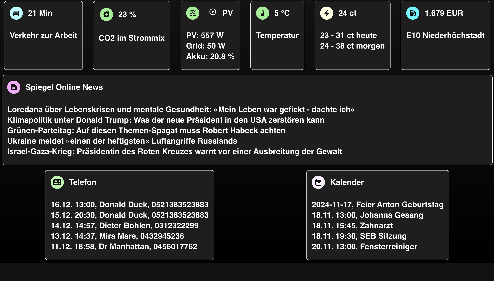
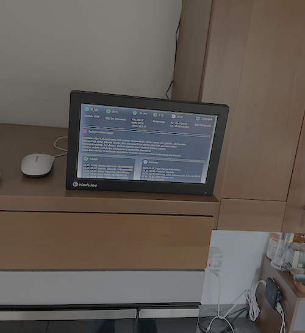

# Optimat Next - a simple kitchen dashboard with relevant data 

## What is it about?

I wanted to have a simple dashboard in the kitchen displaying relevant information for the family life - both with home related information and stuff like calendar and missed calls. And it should run on a small screen that doesn't consume a lot of energy.

Currently it displays:
- Traffic information to a particular location
- Energy mix in the grid, how much dirty energy there is compared to renewable energy?
- Output of the solar roof and status of the battery (using an AlphaESS system)
- Outside temperature
- Current energy price using Tibber
- Current fuel price nearby
- News feed
- Missed calls on the Fritz Box
- Curren family calendar

## Why Optimat, there's Home Assistant and others?

Sure, there are other solutions, but for me they were too heavyweight and not custom
isable enough.

This one is a simple `nextjs` app, for which you only need to implement an API function and a web component to render it in the dashboard. The web components can be anything that is possible in Material UI (this is the part I didn't like about Home Assistant)

## How to install and configure
This needs more explanation, but the quick way is:
- Clone the repo and switch to the cloned folder
- Copy `.env_example` into `.env` and update all information
- Run `npm install`
- Run  `npm run dev` and check if it's all working
- Run `npm run build` and let `pm2` manage the restarts etc

## Known issues
- I think the Fritz API loses the token after a while and cannot retrieve the phone calls
