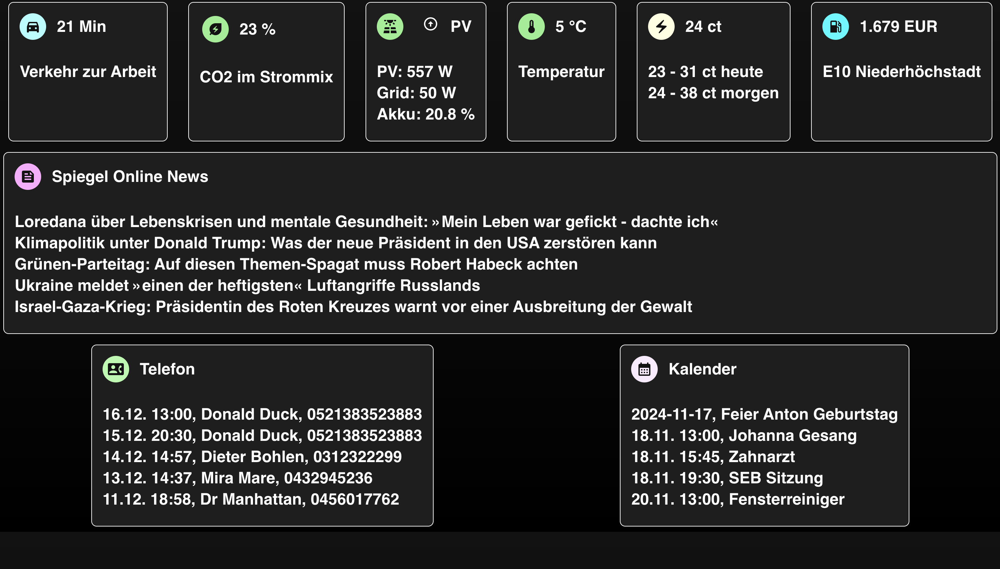
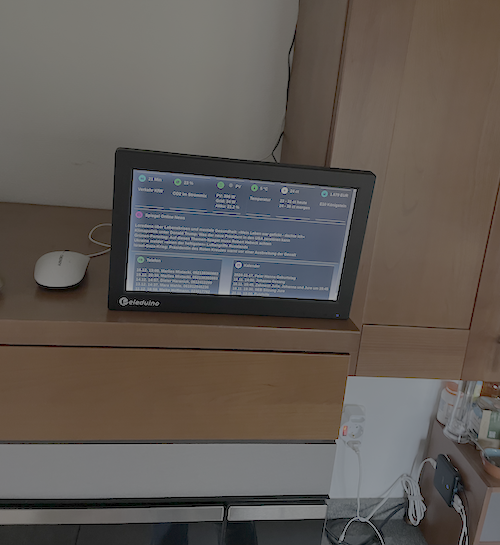

# Optimat Next - a simple kitchen dashboard with relevant data

## What is it about?

I wanted to have a simple dashboard in the kitchen displaying relevant information for the family life - home related information plus stuff like calendar and news. It runs on a small, low-resolution (1366x768) always-on kitchen screen, so the UI is built for high contrast and readability at a distance rather than for touch interaction.

Currently it displays:
- Traffic information to a particular location
- Carbon intensity of the electricity grid (Electricity Maps)
- Output of the solar roof and status of the battery (using an AlphaESS system)
- Outside temperature
- Current energy price using Tibber
- Current fuel price nearby
- News feed
- Family calendar
- Mastodon home timeline

(An n8n markdown feed is also wired up as a data source, but is not shown on the dashboard by default.)

## Why Optimat, there's Home Assistant and others?

Sure, there are other solutions, but for me they were too heavyweight and not customizable enough.

This one is a simple `nextjs` app, for which you only need to implement an API function (a "source") and a UI panel to render it in the dashboard. The UI is built with [shadcn/ui](https://ui.shadcn.com/) primitives on top of Tailwind CSS.

## Architecture

- **Sources** (`lib/sources/*.ts`) are plain async functions that fetch and normalize data from one upstream API. They throw on failure and never touch the cache themselves.
- **Scheduler** (`lib/cache/scheduler.ts`) runs one independent refresh loop per source, on that source's own TTL, starting once when the Node server boots (via `instrumentation.ts`). On failure it keeps serving the last good value, marks it `stale`, and backs off exponentially (capped at 8x the normal interval) instead of hammering a struggling upstream API.
- **Store** (`lib/cache/store.ts`) is an in-memory cache, persisted to `.cache/store.json` on every write so a restart doesn't start from a blank dashboard.
- **API routes** (`/api/dashboard`, `/api/n8n`) only ever read from the store — they never trigger a live upstream fetch, so they always respond instantly regardless of upstream health. `/api/n8n` is the one exception: n8n pushes markdown to it via `POST` instead of being polled.
- **The page** (`pages/index.tsx`) renders from the cache on first load (`getServerSideProps`) and then polls `/api/dashboard` every 30s from the browser, with a request timeout and a "no connection" banner if polling starts failing — the last known-good data stays on screen either way.

This design means an API outage, a network blip, or a strict rate limit on one provider never affects the others, and the dashboard itself never blocks on (or blanks out because of) a slow upstream request.

## How to install and configure

- Clone the repo and switch to the cloned folder
- Copy `.env.example` into `.env` and fill in the credentials for whichever sources you want
- Run `npm install`
- Run `npm run dev` and check if it's all working
- Run `npm run build` and let `pm2` manage the restarts etc
